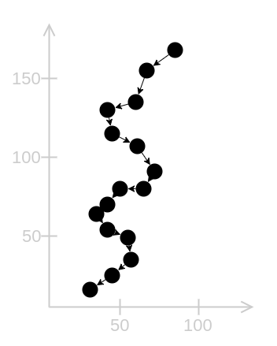

# Trajectory Comparison

The project is called _trajecmp_ which is a abbreviation of _trajectory comparison_.

## Abstract

I'd like to detect specific movements in 2D and 3D space that are described as trajectories (called patterns).
Input trajectory (recorded movement) and pattern trajectory (description of a specific movement) are preprocessed and
compared by distance to each other. Dependent on the result, a function is called to process the result.

## Introduction

There are several input devices to track movements of objects in 2D and 3D space.

The most common input device of a computer is a mouse that tracks the movement of your hand.

On a smartphone you track movements of the finger tips on a touchscreen. 

For 3D space there is a wide variety of more or less known input devices.
One of them is the Leap Motion that usually is attached to a virtual reality headset to track your hands.

All those input devices determine the current position of a moving object.
You can record the position of an object over time to get a trajectory that represents the movement of the object.
Movements can be used to interact with an application.
For example, specific movements can trigger special events.
To prevent the user from unintentionally triggering events by accidentally doing a specific movement
you can define an interaction (for example a button press or a pinch gesture)
that controls the recording (start and stop).
Thereby, you only record trajectories that are intended by the user.

Imagine a game where you play a wizard that can do magic tricks by moving his
magic wand (see [MagicVR](https://github.com/maiermic/MagicVR)).
By drawing a lightning in the air you can magic up a flash light.

Such kind of movements can quite easily be defined as a trajectory.

However, it is very unlikely that exactly the same trajectory is drawn and recorded.
It is more probable that you get something like this as input:

The input trajectory has more points, different length/size, another position, etc.
It is not equal to our defined trajectory, but it looks similar and should be recognized as our lightning movement.
We can achieve this by comparing our two trajectories using an appropriate distance function and proper preprocessing.
This library helps you with this process.

## What To Read Next

Take a quick look at the [terminology](doc/terminology.md) I use.
Then read the [system description](doc/system.md) to get a better understanding how it works.
Have a look at the examples to see it in action.
[This](doc/how-to-build.md) guide explains how to build the tests and examples.
If your browser supports [WebAssembly] you can run [this][online demo] demo online. 

[WebAssembly]: http://caniuse.com/#feat=wasm
[online demo]: http://cpppc.maiermic.surge.sh/
