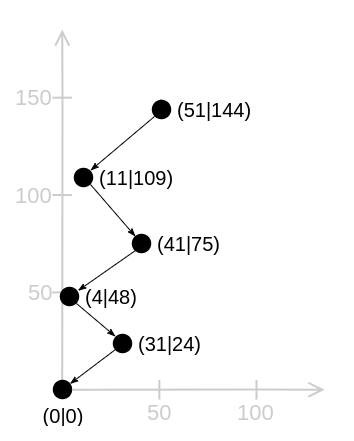
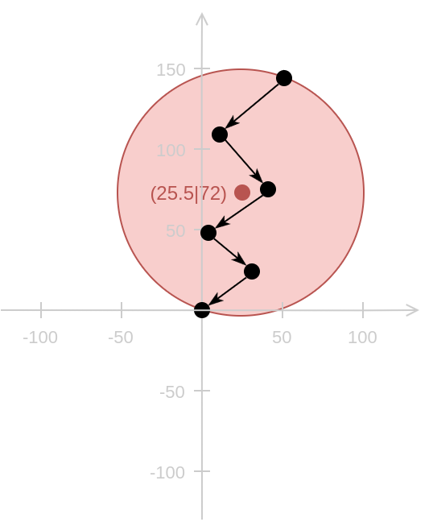
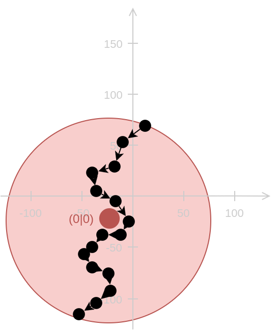
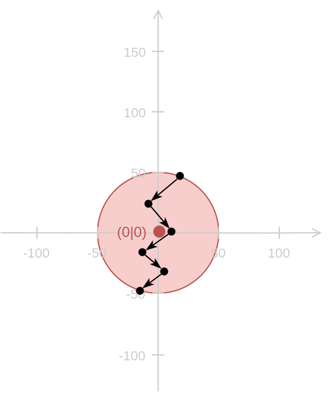
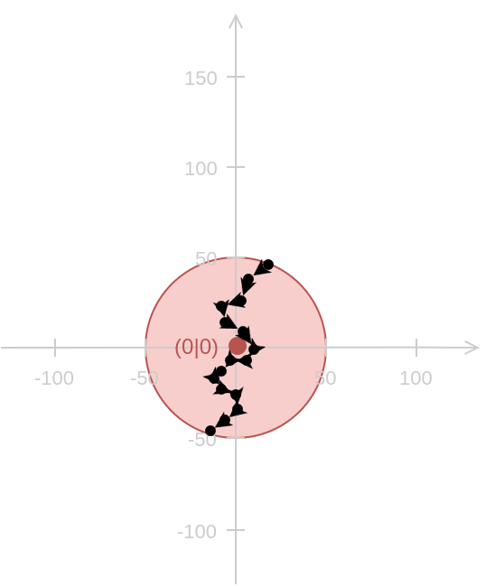
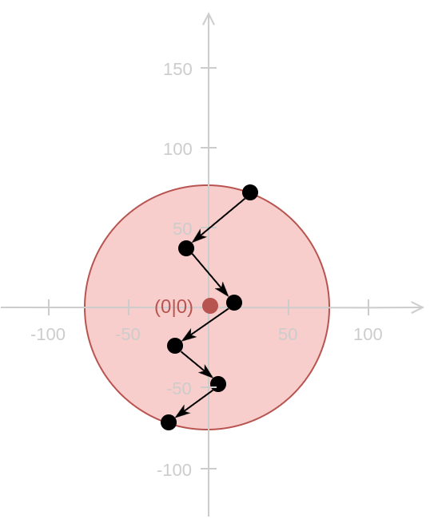
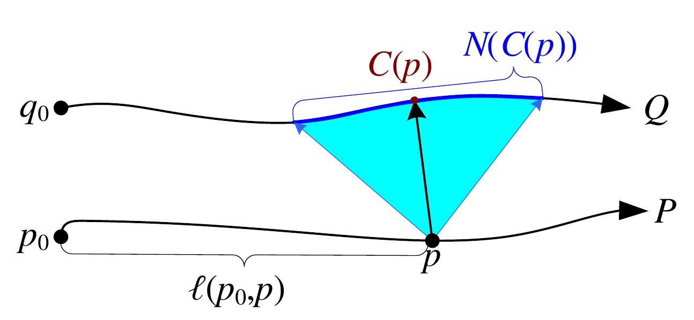
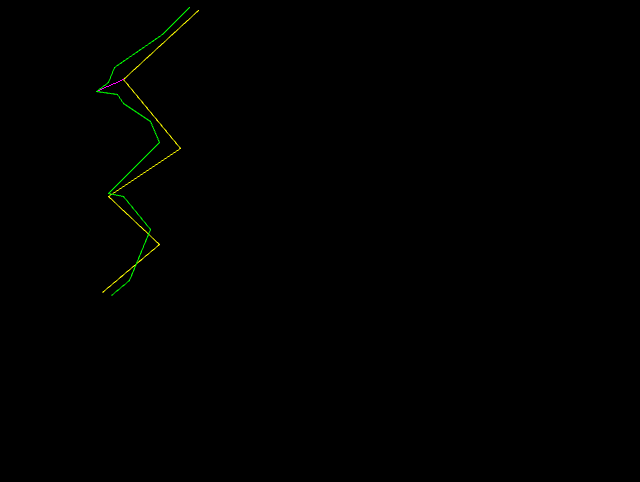
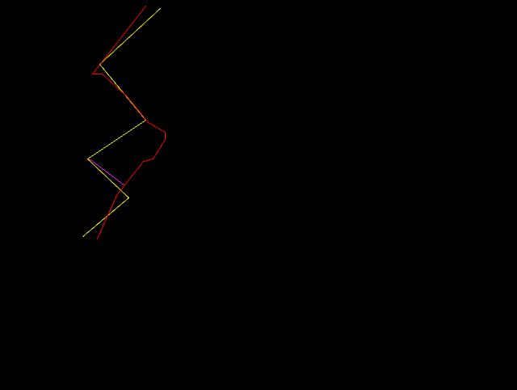

# Concept

## Definition Of Gestures
A gesture describes a movement.
It is defined using a trajectory that describes the movement, preprocessing
functions that transform trajectories and a comparison function that checks if
two trajectories are similar.

## Detection Of Gestures
Input trajectory (recorded movement) and pattern trajectory (description of a
specific movement) are preprocessed and compared by distance to each other.
Dependent on the result, a function is called to process the result (change the
state of the application and trigger events (show effects)):

### Preprocessing
A pattern trajectory describes the ideal path of a movement.
It is very unlikely that exactly the same trajectory is drawn and recorded.

    

         
        <label>(a) pattern trajectory</label>
    

    

         
        <label>(b) recorded trajectory</label>
    

 
Most commonly, input and pattern trajectory differ in the number of points,
length/size, position, etc.
Distance functions may assume specific preconditions.
For example, some require that both trajectories have equal number of points or
length.
The goal of the preprocessing is to prepare a trajectory for comparison with
another trajectory:

    

        

            

                
            

            

                
            

        

        <label>i. Trajectories before the preprocessing (pattern on the left, input on the right) differ in length/size and position.</label>
    

     
    

        

            

                
            

            

                
            

        

        <label>ii. Trajectories after the preprocessing (pattern on the left, input on the right) have similar length/size and the same position.</label>
    

 

The appropriate preprocessing steps depend on the same factors as the limit that is used for [deciding similarity](#deciding-similarity) including the preprocessing itself in that way that the preprocessing steps influence each other.
It is important to translate the trajectory to the origin before it is scaled:

    

        

            
             
            <label>i. Calculate Minimum Bounding Sphere</label>
        

        

            
             
            <label>ii. Translate</label>
        

        

            
             
            <label>iii. Scale</label>
        

    

     
    <ol type="i">
        <li>
            The smallest circle (hyper sphere) that contains all points of the trajectory is calculated.
        </li>
        <li>
            Then the trajectory is moved so that the center of this circle is in the origin.
        </li>
        <li>
            After that the trajectory is scaled so that the diameter of the circle is 100.
        </li>
    </ol>

### Comparing Trajectories
To check two trajectories for similarity we use a distance function to calculate the distance between them.
The distance is a scalar that indicates how similar two trajectories are.
We can decide similarity based on a limit.
If the distance is lower than the limit we consider two trajectories to be similar.

#### Distance Function
There is a wide range of distance functions to choose from.
Each has its pros and cons.
Good results are obtained using a [modified Hausdorff distance function](modifiedHausdorffDistFn).

It is a variant of the Hausdorff distance that takes the order of the points into account.
It runs over all discrete points of both trajectories.
The unmodified version of the Hausdorff distance determines the distance between each point and the other trajectory.
The modified variant, on the other hand, only takes a subtrajectory - here `N(C(p))`.
For this purpose, the point `C(p)` on the other trajectory is determined for each point `p`. `C(p)` is the point that lies at the same position relative to the length of the trajectory.
`N(C(p))` defines the neighborhood of `C(p)`. These are all points which are only a certain distance away from `C(p)` along the trajectory.
The minimum distance to `p` is determined for this subtrajectory. I use the distance from point to distance, i. e. I consider the subtrajectory as a set of distances.
So we now have a lot of space for each point of the discrete trajectory.
The maximum of these distances is then the distance between the two trajectories.
The order of the points is taken into account by `C(p)`.

#### Deciding Similarity

We consider two trajectories to be similar if the distance is lower than the limit.
Here you can see two screenshots of a 2D demo application of trajecmp that visualizes the comparison of two standardized trajectories:

    

        
         
        <label>(i) Similar trajectories</label>
    

    

        
         
        <label>(ii) Dissimilar trajectories</label>
    

 The yellow trajectory represents the lightning pattern.
(i) shows a green trajectory, which has been classified as similar.
In (ii) you can see a red trajectory, which has been classified as dissimilar.
The pink line represents the distance that has been calculated using the [modified Hausdorff distance function](modifiedHausdorffDistFn).

Finding a good limit is crucial to avoid/reduce false positives and negatives.
If the limit is not tolerant enough, measuring inaccuracy of the input device recording the object position and natural small deviations during each movement execution will make it hard or impossible to recognize a movement.
If the limit is too tolerant we consider trajectories to be similar that should not.

Another important factor is the preprocessing of the trajectories.
Each preprocessing step might influence the distance (positive or negative).
The influence depends on the distance function.
Please also note that the distance might not grow linear.
For example, some distance functions use squared values.
Moreover, you should devote special attention to the scale of the trajectories, since the distance itself depends on it.

Taken together, the limit depends on

- the measuring (in-) accuracy of the input device
- the minimum movement execution accuracy we claim from the user
- the preprocessing of the trajectories
- the scale of the trajectories
- the distance function

[modifiedHausdorffDistFn]: https://pdfs.semanticscholar.org/e422/b3bcf04a0f9ace1a4ea2b8be583831eec547.pdf