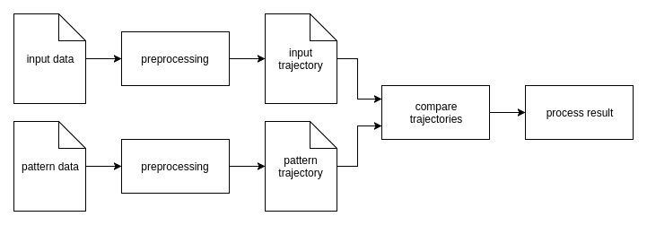

## Abstract

I'd like to detect specific movements in 2D and 3D space that are described as trajectories (called patterns).
Input trajectory (recorded movement) and pattern trajectory (description of a specific movement) are preprocessed and
compared by distance to each other. Dependent on the result, a function is called to process the result.

### Transformation

A transformation operation is a [Callable][Callable] with signature `Trajectory (const Trajectory &)`.
It might be a functor that depends on input arguments.
For example, `translate_by(vector)` creates a transformation operation that translates a trajectory by `vector` and
returns the result.

[Callable]: http://en.cppreference.com/w/cpp/concept/Callable