# Erkenne Rechteck während dem Zeichnen ([sdl2-match-rectangle-while-drawing.cpp][sdl2-match-rectangle-while-drawing])
Dieses Beispiel zeigt, wie man anhand von Sub-Patterns während dem Zeichnen
erkennen kann, wie viel Prozent eines Patterns bisher gezeichnet worden sind.

## Beschreibung der Geste
Der Nutzer soll ein beliebiges Rechteck zeichnen.
Er muss in der linken oberen Ecke beginnen und als nächstes zu linken unteren
Ecke zeichnen.  
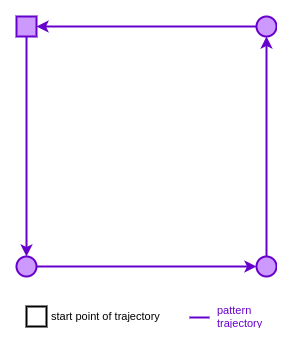

## Beschreibung der Vorgehensweise
Ab [Zeile 75 ff.][L75] wird mit den Sub-Patterns des Rechteck-Patterns
verglichen.
Es gibt 4 Sub-Patterns, die aus 1 bis 4 Seiten bestehen:  
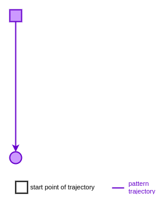
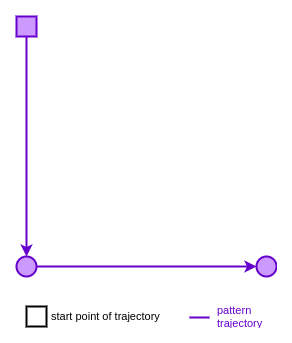  
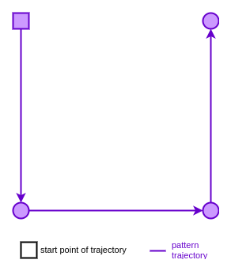
  
Wenn der Nutzer insgesamt die folgende Eingabe-Trajektorie zeichnet, kennt man
während dem Zeichnen nur die ersten Punkte und weiß noch nicht wie das
Gesamtergebnis aussieht.    
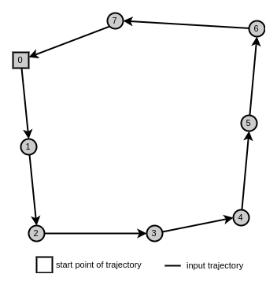  

Nachdem Zeichnen von den ersten 2 und 3 Punkten matcht das erste Sub-Pattern:  
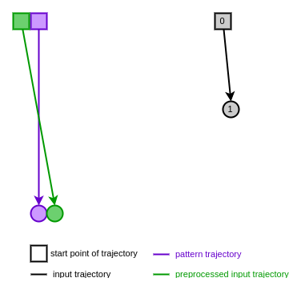
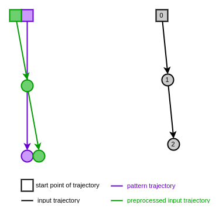  
Da für den Vergleich mit dem (Sub-) Pattern die Eingabe-Trajektorie
normalisiert wird, werden beide als die erste/linke Seite vom Rechteck-Pattern
angesehen, d.h. 25% vom Gesamtergebnis.
Da die Größe bzw. Höhe des Gesamtergebnis nicht bekannt ist, ist diese
Abschätzung naheliegend.  
Es wird jedoch nicht nur mit dem ersten Sub-Pattern verglichen, sondern auch
mit den anderen Sub-Pattern.
Das zweite Sub-Pattern wird auch gematcht.  
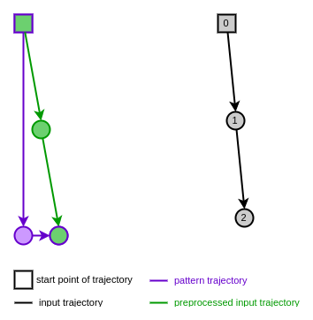  
Der Abstand ist jedoch Größer als der zum ersten Sub-Pattern.
Daher ist es wahrscheinlicher, dass der Nutzer bisher nur das erste Sub-Pattern
gezeichnet hat.

Nachdem Zeichnen von den ersten 4 Punkten matcht das erste Sub-Pattern nicht
mehr bzw. wird der Abstand mit jedem weiteren Punkt immer größer:  
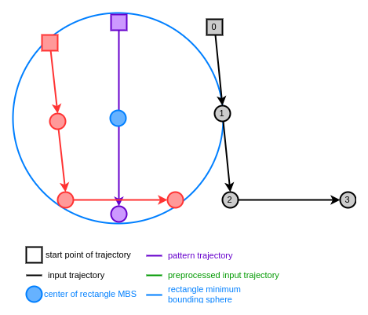  
Im Gegensatz dazu matcht das zweite Sub-Pattern nun mit dem kleinsten Abstand:  
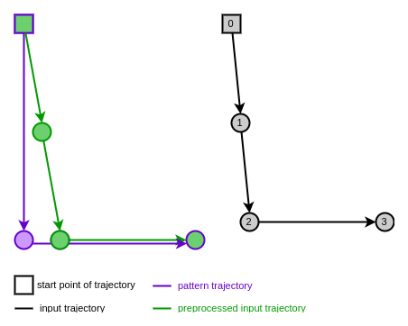  
Als gesamtes Rechteck-Pattern wird das Minimum Bounding Rectangle verwendet.
Dadurch passt sich das (Sub-) Pattern an die Größe (Höhe und Breite) der
Eingabe-Trajektorie an und erlaubt es beliebige Rechtecke zu zeichnen.

Mit dem 6. Punkt verläuft die Eingabe-Trajektorie wieder nach oben.
Der Abstand zum zweiten Sub-Pattern wird nun größer (Abstand zwischen den
End-Punkten von Eingabe- und Sub-Pattern-Trajektorie).
Das 3. und 4. Sub-Pattern muss an die Länge der Eingabe-Trajektorie angepasst
werden (siehe [Zeile 81-82][L81]).
Dadurch matcht die Eingabe-Trajektorie mit den ersten 6 Punkten das 3. Pattern:  
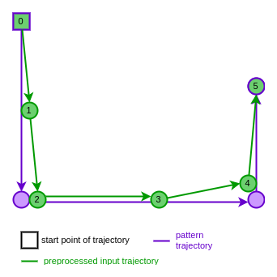  
Das 3. Pattern hat bis zum Punkt 6 den kleinsten Abstand.
Ab Punkt 7 matcht das in der Länge angepasste 4. Sub-Pattern.

Am Ende sieht der Vergleich mit dem Gesamtergebnis so aus:  
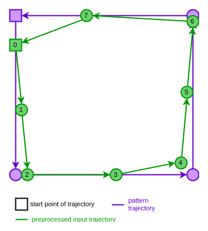  

Sollte der Nutzer etwas anderes als ein Rechteck zeichnen, wird der Abstand zu
allen Sub-Pattern größer als die maximale Abweichung.
Dieser Fall wird nach dem Vergleich mit den Sub-Pattern geprüft (siehe
[Zeile 95 ff.][L95]).

## Fazit
Wie viel Prozent des gesamten Patterns gezeichnet worden ist, lässt sich mit
Sub-Pattern vorhersagen.
Solange sich die Größe der Eingabe-Trajektorie (Minimum Bounding Sphere) ändert,
ändert sich auch die Größe des erwarteten Gesamtergebnis.
Dabei ändert sich der Prozentwert teilweise sprunghaft (von 25% auf 50%).
Erst wenn die Minimum Bounding Sphere sich kaum mehr verändert (im Beispiel
nach Punkt 4), steigt der Prozentwert kontinuierlich gegen 100%.

[sdl2-match-rectangle-while-drawing]: ../../example/sdl2/app/sdl2-match-rectangle-while-drawing.cpp
[L75]: ../../example/sdl2/app/sdl2-match-rectangle-while-drawing.cpp#L75
[L81]: ../../example/sdl2/app/sdl2-match-rectangle-while-drawing.cpp#L81
[L95]: ../../example/sdl2/app/sdl2-match-rectangle-while-drawing.cpp#L95
