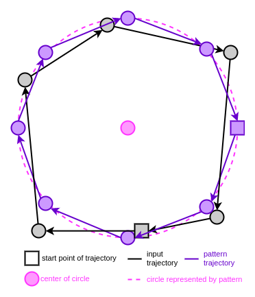
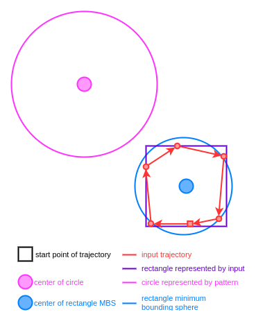
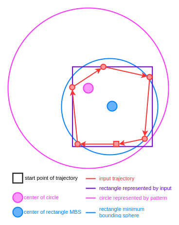
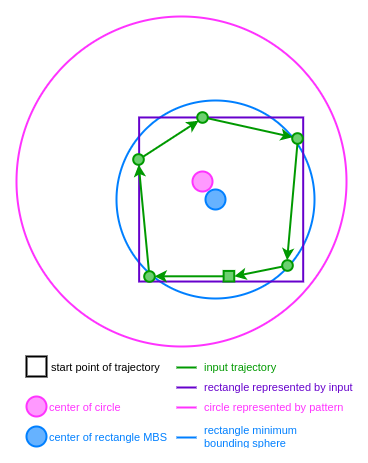

# Rechteck im Kreis ([sdl2-rectangle-in-circle.cpp][sdl2-rectangle-in-circle])
Dieses Beispiel zeigt, wie man eine
[kombinierte Trajektorie](../gestures-advanced.md#combined)
definiert, deren Teil-Trajektorie [positions- und größen-abhängig](../gestures-advanced.md#position-size-orientation-dependend)
ist.

## Beschreibung der Geste
Zuerst soll ein Kreis gezeichnet werden.
Dann soll ein Rechteck in dem Kreis gezeichnet werden.
Das Rechteck muss sich vollständig im Kreis befinden,
d.h. es ist keine Überschneidung mit dem Kreis erlaubt.

## Beschreibung der Vorgehensweise
Es ist fast unmöglich einen optimalen Kreis (Pattern) zu zeichnen.
Der gezeichnete Kreis weicht daher auch bei einem Match vom optimalen Kreis ab.
Es ist jedoch von Vorteil, einen optimalen Kreis für die Berechnungen zu
verwenden.
Daher wird nach einem Match die gezeichnete Eingabe-Trajektorie durch das
Pattern ersetzt (siehe [`_beautified_circle_trajectory`][_beautified_circle_trajectory init]).
Beim Rechteck wird das gleiche gemacht (siehe [`beautified_rectangle_trajectory`][beautified_rectangle_trajectory init]).

In `_state` wird festgehalten, welche Trajektorie (Kreis oder Rechteck) als
nächstes gezeichnet werden soll.
Wenn ein Kreis gezeichnet werden soll, wird mit dem Kreis-Pattern verglichen
(siehe [Zeile 142 ff.][L142]), ansonsten mit dem Rechteck-Pattern
(siehe [Zeile 166 ff.][L166]).

Wenn als Kreis die folgende Eingabe-Trajektorie gezeichnet wird,  
    
muss das anschließend zu zeichnende Rechteck im pinken Kreis liegen.
Wenn die MBS der Eingabe-Trajektorie nicht innerhalb der MBS des Kreises liegt,
braucht gar nicht erst geprüft werden, ob es sich bei der Eingabe-Trajektorie
um ein Rechteck handelt (siehe dieses [if-statement][MBS of rectangle in MBS of circle]).  
  
Liegt die MBS innerhalb, wird die Eingabe-Trajektorie mit dem Rechteck-Pattern
verglichen.
Bei einem Match kann es jedoch trotzdem noch vorkommen, dass das
Pattern-Rechteck außerhalb des Kreises liegt, obwohl das gezeichnete Rechteck
innerhalb liegt.  
    
Deswegen muss anschließend geprüft werden, dass das Pattern-Rechteck innerhalb
des Kreises liegt (siehe [Zeile 187 ff.][L187]).
So sieht zum Beispiel ein erfolgreich im Kreis gezeichnetes Rechteck aus:  
  

[sdl2-rectangle-in-circle]: ../../example/sdl2/app/sdl2-rectangle-in-circle.cpp
[_beautified_circle_trajectory init]: ../../example/sdl2/app/sdl2-rectangle-in-circle.cpp#L147
[beautified_rectangle_trajectory init]: ../../example/sdl2/app/sdl2-rectangle-in-circle.cpp#L173
[MBS of rectangle in MBS of circle]: ../../example/sdl2/app/sdl2-rectangle-in-circle.cpp#L129
[L142]: ../../example/sdl2/app/sdl2-rectangle-in-circle.cpp#L142
[L166]: ../../example/sdl2/app/sdl2-rectangle-in-circle.cpp#L166
[L187]: ../../example/sdl2/app/sdl2-rectangle-in-circle.cpp#L187

