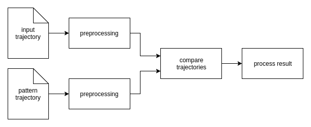
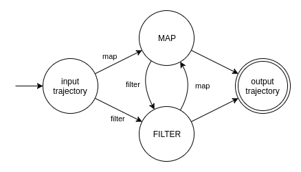

# How It Works

I like to describe specific movements as trajectories that I call _pattern trajectories_.
The recorded movements of the user are called _input trajectories_ in the following.
I like to check input and pattern trajectory for similarity.
This system diagram visualizes my approach:



It looks like this in C++

```c++
const auto result_stream = compare(preprocess(input_stream),
                                   preprocess(pattern_stream));

result_stream.subscribe([](auto &&result) {
    // process result
});
```

You define the source of your input trajectory (`input_stream`) and your pattern trajectory (`pattern_stream`).
Then you preprocess both of them to prepare them for comparison.
You compare the preprocessed trajectories and define what to do with the result.

`input_stream` and `pattern_stream` are streams of trajectories.
Every time a input trajectory is emitted on `input_stream` it is preprocessed and
compared with the (latest) preprocessed pattern trajectory of `pattern_stream`.
Usually, `pattern_stream` contains only one (static pattern) trajectory.
However, a pattern trajectory might be dynamically created.
For example, you could use another input trajectory as a pattern.

You can compare the input trajectory with multiple patterns like this:

```c++
const auto preprocessed_input_stream = preprocess(input_stream);

const auto result_1_stream = compare(preprocessed_input_stream,
                                     preprocess(pattern_1_stream));

const auto result_2_stream = compare(preprocessed_input_stream,
                                     preprocess(pattern_2_stream));

result_1_stream.subscribe([](auto &&result) {
    // process result
});

result_2_stream.subscribe([](auto &&result) {
    // process result
});
```


## Comparing Trajectories

To check two trajectories for similarity we use a distance function to calculate the distance between them.
The distance is a scalar that indicates how similar two trajectories are.
We can decide similarity based on a limit. 
If the distance is lower than the limit we consider two trajectories to be similar.


### Distance Function

We can choose different distance functions.
There is a wide range of distance functions to choose from.
Each has its pros and cons.
Which distance function to use is down to you.

Take a look at my [examples](examples.md).
I obtained good results using a modified Hausdorff distance function. See [Learning Traffic Patterns at Intersections by Spectral Clustering of Motion Trajectories](https://pdfs.semanticscholar.org/e422/b3bcf04a0f9ace1a4ea2b8be583831eec547.pdf)
by Atev, Stefan, Osama Masoud and Nikolaos Papanikolopoulos.

I expect the Fréchet Distance to be suitable, too.
See [Measuring the Resemblance of Polygonal Curves](http://dl.acm.org/citation.cfm?id=142699)
by Alt, Helmut und Michael Godau.

Area based distance functions may be suitable for (closed) trajectory patterns with
no specific start point and order of points.
See [Performance evaluation metrics and statistics for positional tracker evaluation](http://ai2-s2-pdfs.s3.amazonaws.com/e686/72c74d44fab77c60c35f015b9e22acc86f91.pdf)
by Needham, Chris J. und Roger D. Boyle.
But this use case can be also solved using modified Hausdorff distance (see
[closed trajectory use case](user-stories.md#closed-trajectory))

### Deciding Similarity

We consider two trajectories to be similar if the distance is lower than the limit.
Finding a good limit is crucial to avoid/reduce false positives and negatives.
If the limit is not tolerant enough, measuring inaccuracy of the input device recording the object position and
natural small deviations during each movement execution will make it hard or impossible to recognize a movement.
If the limit is too tolerant we consider trajectories to be similar that should not.

Another important factor is the preprocessing of the trajectories.
Each preprocessing step might influence the distance (positive or negative).
The influence depends on the distance function.
Please also note that the distance might not grow linear.
For example, some distance functions use squared values.
Moreover, you should devote special attention to the scale of the trajectories,
since the distance itself depends on it.

Taken together, the limit depends on

- the measuring (in-) accuracy of the input device
- the minimum movement execution accuracy we claim from the user 
- the preprocessing of the trajectories
- the scale of the trajectories
- the distance function


## Preprocessing

I already mentioned in the [introduction](../README.md) that most commonly input and pattern trajectory
differ in the number of points, length/size, position, etc.
Distance functions may assume specific preconditions.
For example, some require that both trajectories have equal number of points or length.
The goal of the preprocessing is to prepare a trajectory for comparison with another trajectory.
The appropriate preprocessing steps depend on the same factors as
the limit that is used for [deciding similarity](#deciding-similarity)
including the preprocessing itself in that way that the preprocessing steps influence each other.

The preprocessing is a sequence of filter and/or map operations.

 


### Map (Transform)

Mapping is part of the preprocessing.
It performs a transformation operation that takes a trajectory as input and returns another trajectory as output
without changing the input trajectory.

A transformation operation is a [Callable][Callable] with signature `Trajectory (const Trajectory &)`.
It might be a functor that depends on input arguments.
For example, `translate_by(vector)` creates a transformation operation that translates a trajectory by `vector` and
returns the result.

Examples for commonly used transformations are:
Translation, scaling, rotation, curve smoothing and outlier elimination.

[Callable]: http://en.cppreference.com/w/cpp/concept/Callable


### Filter

Filtering is part of the preprocessing.
It filters (input) trajectories that do not meet the requirements of the comparison or
if the result is foreseeable without further processing.


A filter operation needs a predicate, which is a [Callable] with signature `bool (const Trajectory &)`.
It might be a functor that depends on input arguments.
For example, `has_min_num_points(2)` only lets trajectories pass that have at least two points.
