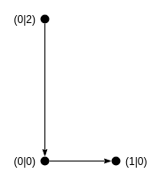

# Terminology
Do not hesitate to [create an issue](https://github.com/maiermic/trajecmp/issues/new)
if you miss the definition of a term.
I will add it as soon as possible.

## Trajectory

A trajectory is a curve defined by a finite sequence of points with linear interpolation between consecutive points.
I reuse the [Boost Geometry Linestring Concept].



```c++
trajectory<point> {
      {0, 2},
      {0, 0},
      {1, 0},
};
```

[Boost Geometry Linestring Concept]: http://www.boost.org/doc/libs/1_60_0/libs/geometry/doc/html/geometry/reference/concepts/concept_linestring.html


## Point

> A point is an entity that has a location in space or on a plane,
> but has no extent.  
> [see Wikipedia](http://en.wikipedia.org/wiki/Point_(geometry))

I focus on 2D and 3D points (cartesian coordinate system). I reuse the [Boost Geometry Point Concept].

[Boost Geometry Point Concept]: http://www.boost.org/doc/libs/1_60_0/libs/geometry/doc/html/geometry/reference/concepts/concept_point.html


## Stream

I use the term _stream_ for _values distributed in time_,
which are represented by the [ReactiveX Observable][ReactiveX Intro] model implemented by [RxCpp].  

[ReactiveX Intro]: http://reactivex.io/intro.html
[RxCpp]: https://github.com/Reactive-Extensions/RxCpp
