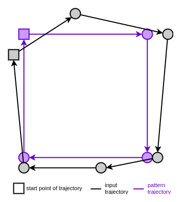

# User Stories

## Eine geschlossene Trajektorie (Anfangspunkt = Endpunkt) soll an einem beliebigen Punkt angefangen werden können.
Nehmen wir als Beispiel-Pattern ein Quadrat, das in der linken oberen Ecke
beginnt und im Uhrzeigersinn gezeichnet wird:  
  
Wir möchten dem Nutzer erlauben, dass Quadrat an einem beliebigen Punkt zu
beginnen.
Außerdem soll er es auch gegen den Uhrzeigersinn zeichnen dürfen.
Die Eingabe-Trajektorie im folgenden Beispiel soll als ähnlich angesehen werden: 
  
Dafür muss der Startpunkt und die Punktreihenfolge bei der Normierung an das
Pattern angeglichen werden.
Das Ziel ist es diese normierte Eingabe-Trajektorie zu erhalten:  

Dafür gehen wir wie folgt vor:

1. Berechne Indizes der Punkte mit minimalem Abstand zu Punkten des Patterns
     
   Im Beispiel hat der Punkt `2` der Eingabe-Trajektorie den kleinsten Abstand
   zum ersten Punkt des Patterns.
   Punkt `4` der Eingabe-Trajektorie hat den
   kleinsten Abstand zum zweiten Punkt des Patterns.
   Insgesamt erhält man `[2, 4, 5, 1]`.
   
   Implementiert in `estimate_corners` in [trajecmp/transform/rearrange_closed_trajectory.hpp](../src/trajecmp/transform/rearrange_closed_trajectory.hpp#48).
   Bei einem Rechteck kann man ausnutzen, dass die Eckpunkte gegenüberliegen
   und muss nur für zwei Eckpunkte die minimalen und maximalen Abstände
   berechnen (siehe `estimate_rectangle_corners` in [trajecmp/gesture/rectangle.hpp](../src/trajecmp/gesture/rectangle.hpp#62)) 
2. Zeichenrichtung herausfinden
   1. Sortiere die Indizes: `[1, 2, 4, 5]`
   2. Prüfe anhand der Indizes, ob der Punkt nach dem Startpunkt des Patterns
      auf den Startpunkt folgt (=> gleiche Zeichenrichtung wie Pattern).
      
      Punkt `2` der Eingabe-Trajektorie ist am ähnlichsten zum Startpunkt des
      Patterns.
      Punkt `4` der Eingabe-Trajektorie ist am ähnlichsten zum zweiten Punkt des
      Patterns.
      In den sortierten Indizes muss folglich auf `2` die `4` folgen.
      Dies ist im Beispiel der Fall.
      
      **Bemerkung:** Wäre die Eingabe-Trajektorie gegen den Uhrzeigersinn
      gezeichnet worden, hätte man die Indizes `[4, 2, 1, 5]` erhalten.  
        
      Dann wäre Punkt `4` der Eingabe-Trajektorie am ähnlichsten zum Startpunkt
      des Patterns.
      Punkt `2` der Eingabe-Trajektorie wäre am ähnlichsten zum zweiten Punkt
      des Patterns.
      In den sortierten Indizes `[1, 2, 4, 5]` müsste auf `4` die `2` folgen.
      Da dies nicht der Fall ist, ist die Eingabe-Trajektorie in umgekehrter
      Richtung zum Pattern gezeichnet worden.

3. Teile die Eingabetrajektorie am Index des Startpunkts des Patterns  
   
4. Füge Teile unter Berücksichtigung der Zeichenrichtung zusammen, um für die
   Eingabetrajektorie die gleiche Punktabfolge wie beim Pattern zu erreichen  
   
5. Regulärer Vergleich (wie bei nicht geschlossener Trajektorie)

**Bemerkung:** Sollte das Pattern ähnliche Punkte bzw. mehrmals den gleichen
Punkt enthalten, wird beim 1. Schritt für diese jeweils der gleiche Punkt der
Eingabe-Trajektorie (mit minimalem Abstand) bestimmt.
Stattdessen muss man die lokalen Minima bestimmen, um die Punkte herauszufinden,
die in Frage kommen.
Sollte das Pattern ausreichend andere Punkte enthalten, um die Reihenfolge zu
schätzen, können die ähnlichen Punkte auch ignoriert werden oder gezielt
zwischen ihren Nachbarpunkten gesucht werden.

## Kombinierte Trajektorien sollen definiert werden können (z.B. ein X, das aus 2 Strichen/Trajektorien besteht)
Eine kombinierte Trajektorie besteht aus mehreren Teil-Trajektorien.
Demnach müssen mehrere Trajektorien hintereinander aufgezeichnet werden.
Daraus ergeben sich folgende Fragen: 

- Wann beginnt eine kombinierte Trajektorie?
- Wann endet eine kombinierte Trajektorie?

Wenn die Teil-Trajektorien in einer bestimmten Reihenfolge gezeichnet werden
müssen, beginnt die aufzeichnung einer kombinierten Trajektorie, wenn die erste
Teil-Trajektorie matcht.
Die nächste aufgezeichnete Trajektorie wird mit der nächsten Teil-Trajektorie
der kombinierten Trajektorie verglichen.
Wenn sie matcht, wird die nächste Teil-Trajektorie in der Reihenfolge als
nächstes Pattern verwendet.
Ansonsten matcht die kombinierte Trajektorie nicht und der Vergleich wird
abgebrochen, d.h. der Zustand des kombinierten Trajektorien Vergleichs wird
wieder zurückgesetzt.
Der Vergleich der kombinierten Trajektorie endet spätestens mit der letzten
Teil-Trajektorie.
Sollte auch diese matchen, wird dies als Match der kombinerten Trajektorie
angesehen.

**Bemerkung:** Solange der Vergleich mit der kombinierten Trajektorie läuft,
können keine anderen Patterns matchen, d.h. der Vergleich mit diesen entfällt.
Außerdem müssen alle bereits gezeichneten Teile der kombinierten Trajektorie
dem Nutzer angezeigt werden.

## Es soll möglich sein, die Ähnlichkeit abhängig von der Lage im Raum zu definieren
Der Mittelpunkt der Minimum Bounding Sphere wird mit der gewünschten Position im
Raum verglichen.
Der Abstand zwischen den Punkten wird für die Ähnlichkeitsdefinition verwendet.
Die Orientierung der Eingabe-Trajektorie kann bestimmt werden und ebenfalls in
die Ähnlichkeitsdefinition einfließen.

## Zirkulare Trajektorien (z.B. ein Kreis mehrmals hintereinander am Stück) sollen erkannt werden können (Anzahl Umrundungen).
Wie bei geschlossener Trajektorie, nur dass Minima für jeden Punkt bestimmt
werden müssen. Dann ermittelt man, wie oft die Punktsequenz des Patterns
auftritt.

## Einbeziehung der Orientierung der Wand in die Definition einer Geste.
Wenn man z.B. eine Stichbewegung nach vorne definieren möchte, muss man die
Orientierung der Wand berücksichtigen, um die Stich-Trajektorie von einer
waagrecht gezeicheten Trajektorie (seitliche Bewegung der Wand) unterscheiden
zu können.

### Aufnahme der Orientierung in den Punkt
Bei einem 3D-Punkt kann die Orientierung der Wand durch einen 3D-Richtungsvektor
angegeben werden. Der Punkt und der Richtungsvektor können zu einem 6D-Punkt
kombiniert werden. Folglich bestehen Pattern und Eingabetrajektorie aus
6D-Punkten. Es kann der gleiche Vergleich (Modified Hausdorff) verwendet werden.
Eine Rotations-Transformation für Trajektorien mit 6D-Punkten muss eingeführt
werden. Weitere Anpassungen von Algorithmen könnten notwendig sein.

## Ähnlichkeit soll abhängig von der Zeit (z.B. Geschwindigkeit/Beschleunigung) definiert werden können
Wenn man die Zeit seit beginn der Aufzeichnung in die Koordinaten des Punkts
aufnimmt, kann man diese bei der Ähnlichkeitsdefinition berücksichtigen.
Das gleiche lässt sich mit der Beschleunigung machen.

**Bemerkung:** Ob es wirklich sinnvoll ist die Zeit bzw.
Geschwindigkeit/Beschleunigung in die Ähnlichkeitsdefinition aufzunehmen,
gilt es noch auszuprobieren.

## Erkennung einer Geste während sie gezeichnet wird (Vorhersage was der Nutzer versucht zu zeichnen)
Das Problem ist, dass bisher beim Trajektorien-Vergleich von einer vollständigen
Eingabe-Trajektorie ausgegangen wird, die mit einem bestimmten Pattern
verglichen wird.
Der aktuell aufgezeichnete Teil der Eingabe-Trajektorie stellt nur eine
Sub-Trajektorie der vollendeten Eingabe-Trajektorie dar.
Deswegen müsste die Sub-Trajektorie der Eingabe-Trajektorie mit einer
Sub-Trajektorie des Pattern verglichen werden.
Eine Sub-Trajektorie des Patterns kann andere Eigenschaften und Besonderheiten
aufweisen, die vom Trajektorien-Vergleich für das Pattern nicht berücksichtigt
werden.
Man bräuchte daher einen anderen Trajektorien-Vergleich für eine Sub-Trajektorie
des Patterns.

Sollte der gleiche Trajektorien-Vergleich verwendet werden können, kann die
Sub-Trajektorie des Patterns anhand der Länge der Eingabe-Trajektorie, der
Zeichen-Zeit, -Geschwindigkeit oder -Beschleunigung abgeschätzt werden.
Das Problem ist, dass weitere Unbekannte, wie z.B. die Größe der
Eingabe-Trajektorie, die Ungenauigkeit der Ähnlichkeitsbestimmung erhöhen.

Eigentlich widerspricht das Problem dem Ansatz von trajecmp.
Eine wesentliche Idee ist es, die Komplexität des Problems zu reduzieren,
in dem man Anfangs- und End-Punkt der Trajektorien gegeben bekommt.
Wenn eine Sub-Trajektorie des Patterns bestimmt werden muss, ist der End-Punkt
nicht gegeben.

Eine Alternative zum Schätzen einer Sub-Trajektorie des Patterns ist es,
mehrere Sub-Patterns (Sub-Trajektorien des Patterns mit 10%, 20%, ..., 90%, 100%
des Patterns) zu erstellen.
Für jedes Sub-Pattern kann wenn Nötig ein anderer Vergleich definiert werden.
Man vergleicht nun immer mit all diesen Sub-Patterns und weiß bei einem Match,
wie viel Prozent des Patterns gezeichnet worden ist.
Ein Nachteil dieser Variante ist eine relativ hohe Laufzeit, da viele Vergleiche
ausgeführt werden müssen.

Hinzu kommt, dass es strittig sein dürfte was der Nutzer versucht zu zeichnen.
Unzuverlässige Vorhersagen sind zu befürchten und für den Benutzer schlecht
nachzuvollziehen.